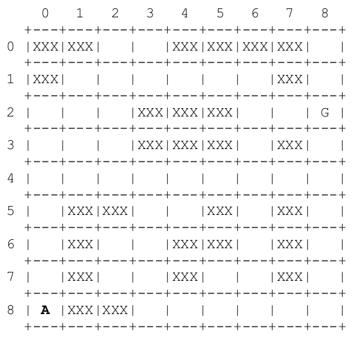

# Sistemas Inteligentes
Tarefas para o curso de Sistemas Inteligentes.

__Ementa:__ Definição de Inteligência Artificial. Histórico e Paradigmas. Resolução de
Problemas. Estratégias de Pesquisa em Espaços de Estados. Conhecimento e Raciocínio.
Elaboração de Planos de Conhecimento Incerto e Raciocínio. Fundamentos de Computação
Natural. Aprendizado. Aplicações.

 - Custo Uniforme e A*
 - Algoritmo Genético
 - Prolog
 - ID3
 - Fuzzy
 
 --------------
 ###  Labirinto:
 
 
